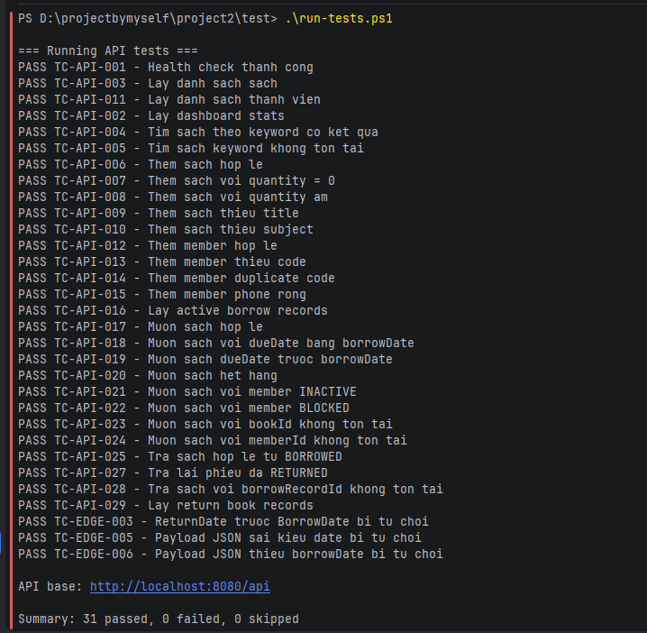
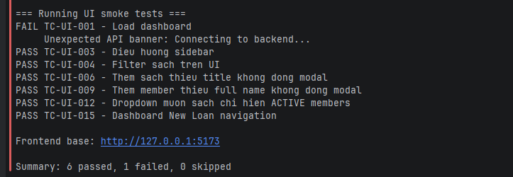

# Automated test runner

Thu muc nay chua code de chay cac test case trong `03_Test_Cases.md`.

## Dieu kien truoc khi chay

- Node.js 18+.
- Backend dang chay tai `http://localhost:8080`.
- Database `LibraryManagementDemo` da duoc seed.
- Neu chay UI smoke test, frontend dang chay tai `http://127.0.0.1:5173`.
- Playwright da co trong `frontend/node_modules` sau khi chay `npm install` trong thu muc `frontend`.

## Lenh chay

Chay tat ca:

```powershell
cd D:\projectbymyself\project2\Test
.\run-tests.ps1
```

Chi chay API:

```powershell
cd D:\projectbymyself\project2\Test
.\run-tests.ps1 -Suite api
```

Chi chay UI smoke:

```powershell
cd D:\projectbymyself\project2\Test
.\run-tests.ps1 -Suite ui
```

Chay UI va nhin thay browser tu thao tac:

```powershell
cd D:\projectbymyself\project2\Test
.\run-tests.ps1 -Suite ui -Headed -SlowMoMs 700
```

Co the override URL:

```powershell
$env:API_BASE_URL="http://localhost:8080/api"
$env:FRONTEND_BASE_URL="http://127.0.0.1:5173"
.\run-tests.ps1
```

## Hinh anh ket qua mau

Ket qua khi chay API tests:



Ket qua khi chay UI smoke tests:



## Video demo test UI

Video ghi lai qua trinh chay lenh:

```powershell
.\run-tests.ps1 -Suite ui -Headed -SlowMoMs 700
```

<video src="assets/video-Test-LMS.mp4" controls width="100%"></video>

Neu GitHub khong render video truc tiep trong README, co the mo file tai day: [video-Test-LMS.mp4](assets/video-Test-LMS.mp4).

Ky thuat test trong video:

- Functional UI Testing: kiem tra cac chuc nang frontend nhu dashboard, book management, member management va circulation.
- End-to-End Testing: thao tac tu UI React, goi backend API va cap nhat du lieu SQL Server.
- Smoke Testing: xac minh cac luong quan trong nhat cua ung dung van hoat dong.
- Negative Testing: kiem tra validation khi them sach thieu title va them member thieu full name.
- State Transition Testing: tao phieu muon va tra sach, kiem tra luong active loan.

Ket qua trong lan chay demo:

- Tong so UI test cases: 12.
- Passed: 12.
- Failed: 0.
- Skipped: 0.

## Mapping chinh

- `automated/api-tests.mjs`: bao phu API, business rule, negative, boundary, integration voi DB.
- `automated/ui-smoke-tests.mjs`: bao phu UI navigation, modal validation, dropdown va dashboard smoke.
- `automated/run-all.mjs`: chay API va UI smoke theo thu tu.

## Luu y

- API tests co tao du lieu test moi voi ma unique. Nen reset DB seed neu muon moi lan chay co dataset sach.
- Mot so negative case co the tra HTTP 500 do backend chua co global exception handler. Test van pass neu request bi reject, nhung nen ghi defect neu can chuan hoa thanh HTTP 400.
- UI smoke test se skip co thong bao neu frontend khong reachable.
